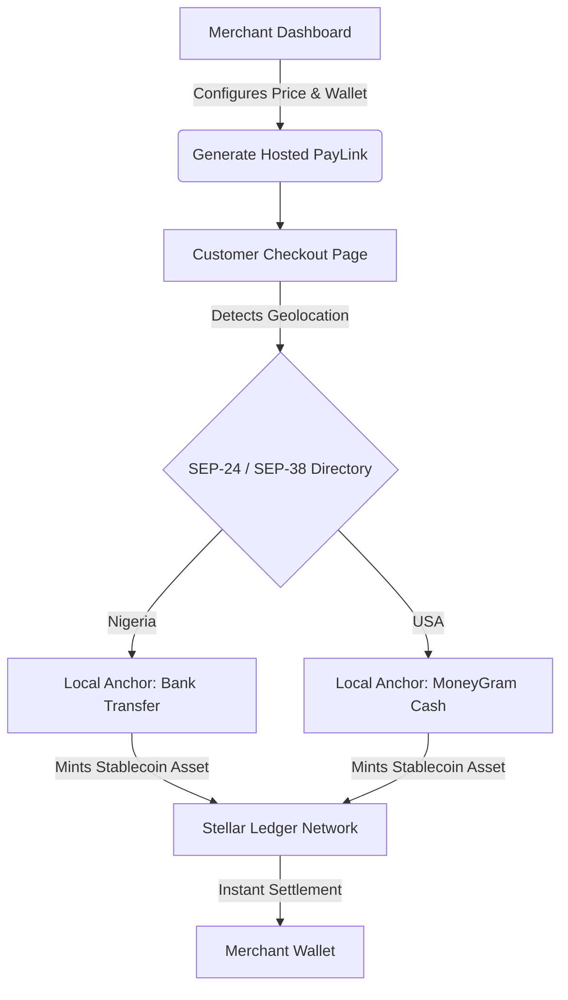

# PayLink 🚀

## 🎯 The Problem & Strategic Opportunity

Stellar boasts a world-class network of global **Anchors** (e.g., MoneyGram, YellowCard, Flutterwave), making fiat-to-crypto on/off-ramps faster and cheaper than any other ecosystem. However, for traditional merchants and e-commerce businesses, integrating these specialized anchor protocols into their websites requires intensive backend engineering.

Because Web3 adoption is fundamentally a user-experience bottleneck, **PayLink** abstracts the complexity of the ledger. It allows non-technical business owners to generate sleek, consumer-grade payment links. Customers pay using their regional fiat infrastructure via standard anchor protocols, while merchants get settled instantly, non-custodially, in stablecoins ($USDC / $EURC$).

---

## ✨ Key Features

- **No-Code Link Generator:** A beautiful merchant dashboard to configure products, set fixed or dynamic fiat pricing, and instantly deploy hosted payment URLs.
- **Geolocation-Aware Checkout:** The payment view automatically detects the customer's region to surface local, authorized Stellar Anchors (e.g., Bank Transfer in Nigeria, Cash at MoneyGram in the US).
- **Invisible Web3 UX:** Customers don't need a crypto wallet or an understanding of public keys. The application layer handles deposit addresses and routing seamlessly.
- **Real-time Ledger Tracking:** Frontend tracking using reactive hooks to stream deposit status, offering immediate payment confirmation to both buyer and seller.

---

## 🏗️ Architecture & How It Works

PayLink functions as a lightweight, frontend-driven dApp communicating natively with browser wallets and the Stellar network.



### Stellar Ecosystem Standards Utilized

- **SEP-24:** Interactive Anchor Deposit standard to handle local cash-in workflows directly inside our clean iframe/modal interface.
- **SEP-38:** Anchor Quote Server API to fetch exact, real-time FX exchange conversion rates from local fiat currencies to target stablecoins.
- **Freighter Wallet API:** Clean, explicit merchant onboarding and cryptographic validation.

---

## 🛠️ Technical Stack & Project Setup

- **Frontend Framework:** Next.js 14 (App Router), TypeScript, TailwindCSS
- **Blockchain Communication:** `@stellar/stellar-sdk`
- **Wallet Integration:** `@stellar/freighter-api`

### Installation

Clone the repository and install dependencies:

```bash
git clone https://github.com/yourusername/paylink.git
cd paylink
npm install
```

Configure environment variables. Create a `.env.local` in the root folder:

```
NEXT_PUBLIC_STELLAR_NETWORK=testnet
NEXT_PUBLIC_HORIZON_URL=https://horizon-testnet.stellar.org
```

Run the development environment:

```bash
npm run dev
```

---

## 🚀 SCF Milestone Roadmap (Build Award Setup)

In compliance with the Stellar Community Fund (SCF) v7.0 guidelines, PayLink is scoped across four specific milestone tranches focusing heavily on execution, safety, and visual readiness:

### 🔹 Tranche 1: Core Dashboard & Wallet Onboarding (10%)

- Implement `stellar-wallets-kit` and native Freighter wallet discovery interfaces.
- Build the Merchant configuration interface for item creation, pricing matrices, and metadata storage.

**Deliverable:** Working dashboard prototype reading real-time Stellar Testnet account states.

### 🔹 Tranche 2: SEP-24 Checkout Engine & MVP (20%)

- Develop the standalone public consumer payment component layout (`/pay/[linkId]`).
- Integrate direct backend-free handshakes with testnet anchor interactive configurations.

**Deliverable:** Functional end-to-end checkout loop capturing local simulation parameters.

### 🔹 Tranche 3: Advanced Rates, Security, & Testnet (30%)

- Implement interactive asset rate quoting engines utilizing SEP-38.
- Establish error boundary states for network latency, failed deposit events, and validation fallbacks.

**Deliverable:** Thoroughly documented Testnet dApp ready for public testing sandboxes.

### 🔹 Tranche 4: Verified Mainnet Launch & UX Readiness (40%)

- Fine-tune load responsiveness, micro-animations, payment transaction notification flows, and multi-device compliance.
- Deploy live production build pointing to Mainnet network corridors alongside onboarding tutorials for real businesses.

**Deliverable:** Publicly testable, audited, community-discoverable Mainnet application.

---

## 📄 License

Distributed under the MIT License. See [LICENSE](LICENSE) for more information.
